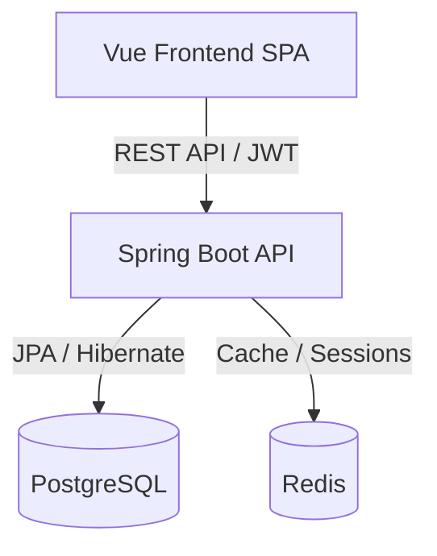

# 🚀 HiringZone Backend — Recruitment Platform API

Production-grade Spring Boot backend powering the HiringZone recruitment ecosystem with secure authentication, role-based access control, scalable REST APIs, and enterprise-ready architecture.

---

## 🌟 Overview

HiringZone Backend is a scalable REST API platform designed to support a modern multi-role job portal ecosystem consisting of:

- 👤 Job Seekers
- 🏢 Employers
- 🛡️ Administrators

The system provides secure JWT authentication, RBAC authorization, job management workflows, application tracking, employer verification pipelines, and administrative moderation capabilities.

Built with scalability, modularity, and production-readiness in mind.

---

# 🛠️ Tech Stack

## Core Backend
- Java 17
- Spring Boot 3.2
- Spring Security
- Spring Data JPA + Hibernate

## Database & Caching
- PostgreSQL
- Redis

## Authentication & Security
- JWT Authentication
- Role-Based Access Control (RBAC)

## Tooling & Infrastructure
- Flyway Database Migrations
- Swagger / OpenAPI 3
- Maven

---

# 🏗️ System Architecture



---

# ✨ Core Features

## 🔐 Authentication & Authorization
- JWT-based stateless authentication
- Multi-role authorization system:
  - ROLE_SEEKER
  - ROLE_EMPLOYER
  - ROLE_ADMIN
- Secure route protection
- Password encryption with Spring Security

---

## 👤 Seeker Platform
- User registration & login
- Profile management
- Job search & filtering
- Job applications tracking
- Saved jobs functionality
- Application statistics

---

## 🏢 Employer Platform
- Employer onboarding
- Job posting management
- Applicants management
- Application status workflows
- Employer analytics dashboard

---

## 🛡️ Admin Platform
- User moderation
- Employer verification
- Job flagging & expiration
- Platform announcements
- Activity monitoring
- Administrative analytics

---

# 📂 API Modules

```text
/api/auth
/api/jobs
/api/profile
/api/applications
/api/employer/*
/api/admin/*
```

---

# 🗄️ Database Architecture

Core relational entities:

- users
- companies
- jobs
- applications
- seeker_profiles
- saved_jobs
- announcements
- admin_logs

Flyway manages schema versioning and migrations automatically.

---

# ⚙️ Environment Variables

```env
DB_URL=
DB_USER=
DB_PASSWORD=

REDIS_HOST=
REDIS_PORT=

JWT_SECRET=

SUPER_ADMIN_EMAIL=
SUPER_ADMIN_PASSWORD=

ALLOWED_ORIGINS=

PORT=9090
```

---

# 🚀 Running Locally

## Prerequisites
- Java 17+
- Maven 3.9+
- PostgreSQL
- Redis

## Development

```bash
mvn spring-boot:run
```

API:
```text
http://localhost:9090
```

Swagger UI:
```text
http://localhost:9090/swagger-ui.html
```

---

# 📦 Production Build

```bash
mvn package -DskipTests
java -jar target/hiring-zone-backend-*.jar
```

---

# 🌐 Deployment

Recommended platforms:

- Render
- Railway
- AWS
- DigitalOcean

Supports containerized deployments and cloud PostgreSQL providers.

---

# 📈 Architecture Highlights

- Layered backend architecture
- Modular REST API design
- Centralized exception handling
- JWT stateless security model
- Database schema versioning with Flyway
- Redis caching integration
- Production-ready CORS handling

---

# 🔮 Planned Improvements

- Docker Compose infrastructure
- CI/CD pipeline
- API rate limiting
- Refresh token rotation
- WebSocket notifications
- Elasticsearch-powered search
- Monitoring & observability
- Kubernetes deployment support

---

# 👨‍💻 Engineering Focus

This project emphasizes:
- scalable backend architecture
- security-first API design
- enterprise RBAC systems
- modular service organization
- production deployment readiness

---

Built to simulate real-world recruitment platform backend engineering at production scale.
